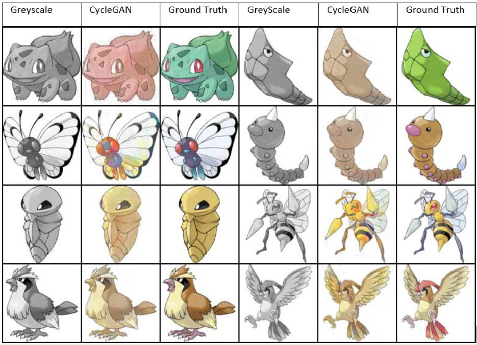

# 0023 - Colorising Sketches Using CycleGAN

Authors: Zhou Xinming, Chong Kay Heen, Yoke Kai Xin, Li Zhuoran, Jiang Yuxin, Tan Yuanhong

Email: e0273876@u.nus.edu, e0201414@u.nus.edu, e0148570@u.nus.edu, e0376940@u.nus.edu, e0261921@u.nus.edu, e0261956@u.nus.edu

[Report](https://docs.google.com/document/d/1ZzMiQPKX1V5IFrULmHcaXNDMTDoQEYHJSrR3qTH1eFI/edit?usp=sharing)

[Poster](https://i.imgur.com/epaJMkh.png)

[Video](https://www.youtube.com/watch?v=I-WMCV1DQbo)

## Usage

* Download datasets: use [this script](https://github.com/arnab39/cycleGAN-PyTorch/blob/master/download_dataset.sh) via `sh ./download_dataset.sh horse2zebra`
* Train the model: `python main.py`
* Test the model
    * rename the latest checkpoint in `checkpoints` folder into `latest.ckpt`
    * run `test.ipynb`

**Note**: training will pick up the latest checkpoint by the name `latest.ckpt`

* Files for training/testing the model:
   * Network definitions for D and G: `discriminators.py` and `generators.py` 
   * CycleGAN architecture: `model.py`
   * Helper functions: `ops.py`, `utils.py`, `extractGreyScale.py`
* Files for evaluating the model
   * `eval_utils.py`
   * `test.ipynb`
